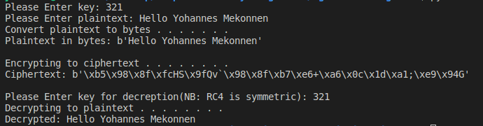

# RC4 Encryption Algorithm


## Introduction

Welcome to the RC4 Encryption Algorithm repository! This project demonstrates the implementation of the RC4 stream cipher for encryption and decryption. The RC4.py file contains the complete implementation of the RC4 algorithm, which includes the Key Scheduling Algorithm (KSA) and the Pseudo-Random Generation Algorithm (PRGA).

## Features

- **Key Scheduling Algorithm (KSA):** Initializes and scrambles the state array.
- **Pseudo-Random Generation Algorithm (PRGA):** Generates a keystream for encryption and decryption.
- **RC4 Encryption/Decryption:** Demonstrates both encryption and decryption using a symmetric key.

## Screenshot




## Video Explanation
- For presentation of the algorithm, check out our .

## Files in the Repository

- **RC4.py:** Contains the RC4 algorithm implementation.
- **README.md:** Documentation file.
- **screenshot.png:** Image used in the README.

## Running the Code

Follow these steps to run the RC4 algorithm:

1. **Clone the repository**
   ```bash
   git clone https://github.com/yourusername/RC4-Encryption-Algorithm.git
